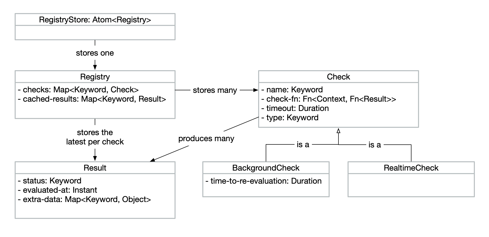
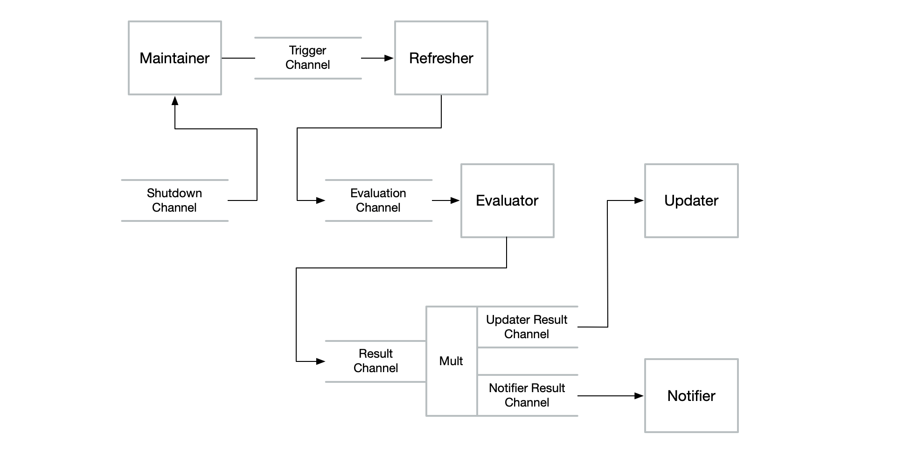

# Getting Started

`salutem` is a system for defining and maintaining a collection of health checks
with support for:

* both realtime and background checks,
* a registry for storing, finding and resolving checks, and
* an asynchronous maintenance system for ensuring that the results of checks are
  kept up-to-date according to their definition, notifying on the results of
  those checks as needed.

`salutem` is somewhat inspired by
[dropwizard-health](https://github.com/dropwizard/dropwizard-health) which may
provide additional insight into its design.

## Contents

- [Installation](#installation)
- [Definitions](#definitions)
- [Creating checks](#creating-checks)
    - [Check functions](#check-functions)
    - [Producing results](#producing-results)
    - [Creating a realtime check](#creating-a-realtime-check)
    - [Creating a background check](#creating-a-background-check)
- [Evaluating checks](#evaluating-checks)
    - [Synchronously evaluating a check](#synchronously-evaluating-a-check)
    - [Asynchronously evaluating a check](#asynchronously-evaluating-a-check)
    - [Logging during check evaluation](#logging-during-check-evaluation)
    - [Checking if results are out-of-date](#working-with-results)
- [Managing checks using a registry](#managing-checks-using-a-registry)
    - [Creating and populating a registry](#creating-and-populating-a-registry)
    - [Querying a registry](#querying-a-registry)
    - [Resolving checks in a registry](#resolving-checks-in-a-registry)
- [The maintenance pipeline](#the-maintenance-pipeline)
    - [Starting the maintenance pipeline](#starting-the-maintenance-pipeline)
    - [Stopping the maintenance pipeline](#stopping-the-maintenance-pipeline)
    - [Customising the maintenance pipeline](#customising-the-maintenance-pipeline)
    - [Enabling logging](#enabling-logging)

## Installation

Add the following to your `project.clj` file:

```clojure
[io.logicblocks/salutem.core "0.1.6"]
```

## Definitions

`salutem` introduces some domain terminology which we use throughout this guide.
The following domain model and definitions detail the domain.



* A **Check** is identified by its name and includes a function that performs
  the corresponding health check. Checks have a timeout such that if the check
  function takes too long, it can be aborted.
* Checks produce **Results** when they are _evaluated_, indicating the outcome
  of the check. Results have a status, with built-in support for _healthy_ and
  _unhealthy_ results. Results also keep track of the instant at which
  evaluation occurred. Results can also include arbitrary extra data for storing
  other required health check information.
* A **Registry** stores a collection of Checks along with any previously
  generated Results that should be cached.
* A **RegistryStore** is an Atom containing a Registry, used in some places
  where rather than a Registry, a shared reference to a Registry is required.
* Checks within a Registry can be _resolved_ to a Result, which either retrieves
  a cached result or evaluates the check if it is realtime or if there is no
  available result.
* There are currently two types of checks supported, _RealtimeChecks_ and
  _BackgroundChecks_.
* A **RealtimeCheck** is evaluated every time it is resolved such that cached
  Results will never be returned.
* A **BackgroundCheck** is intended to be evaluated in the background
  periodically such that a cached result is returned whenever the Check is
  resolved.

## Creating checks

Checks are created with a name, a check function and some additional and
optional configuration options depending on the type of check.

### Check functions

A check function is an arity-2 function, taking an arbitrary context map and a
callback function:

```clojure
(fn [context callback-fn]
  ...)
```

All check functions must be **non-blocking** and must use the provided callback
function to communicate the result of their evaluation back to `salutem`. For
example, if you are health checking an HTTP endpoint using a non-blocking HTTP
client such as `http-kit`, the check function might look like the following:

```clojure
(require '[salutem.core :as salutem])
(require '[org.httpkit.client :as http])

(fn [context callback-fn]
  (let [url (:url context)]
    (http/get url
      (fn [{:keys [status]}]
        (callback-fn
          (if (<= 200 status 399)
            (salutem/healthy)
            (salutem/unhealthy)))))))
```

If your health check logic is blocking, be sure to use a future within your
check function to convert the check function to a non-blocking operation. For
example, if you have a database driver which only supports blocking operations,
the check function might look like the following:

```clojure
(require '[salutem.core :as salutem])
(require '[clojure.java.jdbc :as jdbc])

(fn [context callback-fn]
  (future
    (try
      (let [handle (get-in context [:database :handle])
            result (jdbc/query handle ["SHOW SERVER_VERSION;"])]
        (callback-fn (salutem/healthy {:version (:server_version result)})))
      (catch Exception e
        (callback-fn (salutem/unhealthy {:exception e}))))))
```

Check functions should also implement some form of timeout on calls that could
block for a long time to prevent resource exhaustion. It may also make sense to
implement some form of circuit breaker within the check function, potentially
with exponential backoff. This is currently left up to the implementer of the
check function but may be incorporated into `salutem` in the future.

### Producing results

You'll notice in the check functions defined [above](#check-functions), we used
[[salutem.core/healthy]] and [[salutem.core/unhealthy]] to produce healthy and
unhealthy results respectively. Whilst it is convenient to have these functions,
there's nothing inherently special about the results generated, except that they
have `:healthy` and `:unhealthy` statuses. Nothing in `salutem` depends on these
statuses and in fact, any status can be used.

If, for example, you need a status to represent that a dependency is in the
process of starting up, you can create such a result using
[[salutem.core/result]] directly:

```clojure
(require '[salutem.core :as salutem])

(salutem/result :starting-up
  {:progress "Connecting flanges"})
```

All of [[salutem.core/healthy]], [[salutem.core/unhealthy]] and
[[salutem.core/result]] keep track of the instant at which evaluation occurred
which by default is the instant at which the result was created. To set a
specific instant for when evaluation occurred:

```clojure
(require '[salutem.core :as salutem])
(require '[tick.alpha.api :as time])

(salutem/healthy
  {:salutem/evaluated-at (time/- (time/now) (time/new-duration 20 :minutes))})
(salutem/unhealthy
  {:salutem/evaluated-at (time/- (time/now) (time/new-duration 20 :minutes))})
(salutem/result :starting-up
  {:salutem/evaluated-at (time/- (time/now) (time/new-duration 20 :minutes))})
```

### Creating a realtime check

Given an HTTP endpoint check function factory such as the following:

```clojure
(require '[salutem.core :as salutem])
(require '[org.httpkit.client :as http])

(defn http-endpoint-check-fn [url]
  (fn [_ callback-fn]
    (http/get url
      (fn [{:keys [status]}]
        (callback-fn
          (if (<= 200 status 399)
            (salutem/healthy)
            (salutem/unhealthy)))))))
```

a realtime check of a hypothetical external user profile service could be
created using the following:

```clojure
(defn user-profile-service-check
  [configuration]
  (let [url (get-in configuration [:services :user-profile :ping-url])]
    (salutem/realtime-check
      :services/user-profile
      (http-endpoint-check-fn url))))
```

[[salutem.core/realtime-check]] additionally supports a `:salutem/timeout`
option which defines the amount of time to wait on a result before considering
the health check evaluation failed. By default, this is 10 seconds. To override
the timeout:

```clojure
(defn user-profile-service-check
  [configuration]
  (let [url (get-in configuration [:services :user-profile :ping-url])]
    (salutem/realtime-check
      :services/user-profile
      (http-endpoint-check-fn url)
      {:salutem/timeout (salutem/duration 30 :seconds)})))
```

### Creating a background check

Creating a background check is much the same as creating a realtime check but
with one extra option, `:salutem/time-to-re-evaluation`, described below.

Again, given an HTTP endpoint check function factory such as the following:

```clojure
(require '[salutem.core :as salutem])
(require '[org.httpkit.client :as http])

(defn http-endpoint-check-fn [url]
  (fn [_ callback-fn]
    (http/get url
      (fn [{:keys [status]}]
        (callback-fn
          (if (<= 200 status 399)
            (salutem/healthy)
            (salutem/unhealthy)))))))
```

a background check of a hypothetical external search service could be created
using the following:

```clojure
(defn search-service-check
  [configuration]
  (let [url (get-in configuration [:services :search :ping-url])]
    (salutem/background-check
      :services/search
      (http-endpoint-check-fn url))))
```

Just as for [[salutem.core/realtime-check]], [[salutem.core/background-check]]
supports a `:salutem/timeout` option which defines the amount of time to wait on
a result before considering the health check evaluation failed. By default, this
is 10 seconds. To override the timeout:

```clojure
(defn search-service-check
  [configuration]
  (let [url (get-in configuration [:services :search :ping-url])]
    (salutem/background-check
      :services/search
      (http-endpoint-check-fn url)
      {:salutem/timeout (salutem/duration 30 :seconds)})))
```

Background checks also have a _time to re-evaluation_ which is the amount of
time to wait before re-evaluating the check to obtain a fresh result. In between
evaluations, whenever the check is resolved, a cached result is returned.
[[salutem.core/background-check]] allows the time to re-evaluation for a check
to be set via the `:salutem/time-to-re-evaluation` option. By default, this is 
10 seconds. To override the time to re-evaluation:

```clojure
(defn search-service-check
  [configuration]
  (let [url (get-in configuration [:services :search :ping-url])]
    (salutem/realtime-check
      :services/search
      (http-endpoint-check-fn url)
      {:salutem/time-to-re-evaluation (salutem/duration 5 :seconds)})))
```

## Evaluating checks

Checks are evaluated using [[salutem.core/evaluate]], with support for both
synchronous and asynchronous evaluation.

### Synchronously evaluating a check

To evaluate a check synchronously:

```clojure
(require '[salutem.core :as salutem])

(def user-profile-service-check
  (salutem/realtime-check :service/user-profile
    (fn [_ callback-fn]
      (callback-fn
        (salutem/healthy {:latency "73ms"})))
    {:salutem/timeout (salutem/duration 5 :seconds)}))

(salutem/evaluate user-profile-service-check)
; => (salutem/healthy {:latency "73ms"})
```

If the check requires something from a context map:

```clojure
(require '[salutem.core :as salutem])

(def user-profile-service-check
  (salutem/realtime-check :service/user-profile
    (fn [context callback-fn]
      (callback-fn
        (salutem/healthy
          {:latency "73ms"
           :caller  (:caller context)})))
    {:salutem/timeout (salutem/duration 5 :seconds)}))

(salutem/evaluate user-profile-service-check
  {:caller :order-service})
; => (salutem/healthy 
;      {:latency "73ms"
;       :caller :order-service})
```

### Asynchronously evaluating a check

To evaluate a check asynchronously, pass a callback function:

```clojure
(require '[clojure.pprint :as pp])
(require '[salutem.core :as salutem])

(def user-profile-service-check
  (salutem/realtime-check :service/user-profile
    (fn [context callback-fn]
      (future
        (Thread/sleep 300)
        (callback-fn
          (salutem/healthy
            {:latency "373ms"
             :caller  (:caller context)}))))
    {:salutem/timeout (salutem/duration 5 :seconds)}))

(salutem/evaluate user-profile-service-check
  {:caller :order-service}
  (fn [result]
    (pp/pprint "Received result.")
    (pp/pprint result)))

(pp/pprint "Waiting on result...")
; Waiting on result...

; some time later

; Received result. 
; {:latency "373ms"
;  :caller :order-service
;  :salutem/status :healthy
;  :salutem/evaluated-at #time/instant "2021-09-05T01:05:17.070Z"})
```

### Logging during check evaluation

It's also possible to produce logs during a check evaluation. If the provided
context map includes a `:logger` entry with a
[`cartus.core/Logger`](https://logicblocks.github.io/cartus/cartus.core.html#var-Logger)
value, log events will be produced throughout the evaluation process. For
example:

```clojure
(require '[salutem.core :as salutem])
(require '[cartus.test :as cartus-test])

(def logger (cartus-test/logger))

(def check
  (salutem/background-check :thing
    (fn [_ callback-fn]
      (callback-fn (salutem/healthy)))))

(checks/evaluate check {:logger logger})

(map 
  (fn [event] 
    (select-keys event [:type :context]))
  (cartus-test/events logger))
; =>
; ({:type :salutem.core.checks/attempt.starting,
;   :context 
;   {:trigger-id :ad-hoc, 
;    :check-name :thing}}
;  {:type :salutem.core.checks/attempt.completed,
;   :context 
;   {:trigger-id :ad-hoc,
;    :check-name :thing,
;    :result {:salutem/status :healthy,
;             :salutem/evaluated-at #time/instant"2021-09-17T10:20:55.469Z"}
```

The events that may be logged during evaluation are:

- `:salutem.core.checks/attempt.starting{:trigger-id, :check-name}`
- `:salutem.core.checks/attempt.threw-exception{:trigger-id, :check-name, :exception}`
- `:salutem.core.checks/attempt.timed-out{:trigger-id, :check-name}`
- `:salutem.core.checks/attempt.completed{:trigger-id, :check-name, :result}`

### Working with results

For healthy and unhealthy results, `salutem` provides two predicates,
[[salutem.core/healthy?]] and [[salutem.core/unhealthy?]] for checking result
status.

Additionally, `salutem` provides the [[salutem.core/outdated?]] function to
determine if a result of a check is no longer up to date. A result is outdated
if:

* it is `nil`;
* it is for a realtime check; or
* it is for a background check and was produced more than the time to
  re-evaluation of the check in the past.

## Managing checks using a registry

A registry manages a set of checks, allowing storage, lookup and resolution of
checks. Registries are immutable and `salutem` provides manipulation functions
for construction and interaction.

### Creating and populating a registry

An empty registry is created using [[salutem.core/empty-registry]]:

```clojure
(require '[salutem.core :as salutem])

(def registry
  (salutem/empty-registry))
```

Checks can be added to the registry using [[salutem.core/with-check]]:

```clojure
(require '[salutem.core :as salutem])

(def registry
  (-> (salutem/empty-registry)
    (salutem/with-check
      (salutem/realtime-check :services/user-profile
        (http-endpoint-check-fn
          "https://user-profile.example.com/ping")
        {:salutem/timeout (salutem/duration 5 :seconds)}))
    (salutem/with-check
      (salutem/background-check :services/search
        (http-endpoint-check-fn
          "https://search.example.com/ping")
        {:salutem/time-to-re-evaluation (salutem/duration 30 :seconds)}))))
```

Whilst mostly for internal use, it's also possible to cache results in the
registry using [[salutem.core/with-cached-result]]. The result cache stores a
single result per check, overwriting an existing result if present.

```clojure
(require '[salutem.core :as salutem])

(def search-service-check-name :services/user-profile)

(def search-service-check
  (salutem/background-check search-service-check-name
    (http-endpoint-check-fn
      "https://user-profile.example.com/ping")
    {:salutem/timeout (salutem/duration 5 :seconds)}))

(def registry
  (-> (salutem/empty-registry)
    (salutem/with-check search-service-check)
    (salutem/with-cached-result search-service-check-name (salutem/healthy))))
```

### Querying a registry

Let's say we have the following registry:

```clojure
(require '[salutem.core :as salutem])
(require '[tick.alpha.api :as time])

(def user-profile-service-check-name :services/user-profile)
(def search-service-check-name :services/search)

(def user-profile-service-check
  (salutem/realtime-check user-profile-service-check-name
    (http-endpoint-check-fn
      "https://user-profile.example.com/ping")
    {:salutem/timeout (salutem/duration 5 :seconds)}))

(def search-service-check
  (salutem/background-check search-service-check-name
    (http-endpoint-check-fn
      "https://search.example.com/ping")
    {:salutem/time-to-re-evaluation (salutem/duration 30 :seconds)}))

(def search-service-result
  (salutem/healthy
    {:latency      "82ms"
     :salutem/evaluated-at (t/- (t/now) (t/new-duration 15 :seconds))}))

(def registry
  (-> (salutem/empty-registry)
    (salutem/with-check user-profile-service-check)
    (salutem/with-check search-service-check)
    (salutem/with-cached-result search-service-check-name search-service-result)))
```

To find a check in the registry:

```clojure
(= search-service-check
  (salutem/find-check registry search-service-check-name))
; => true
```

To find a cached result in the registry:

```clojure
(= search-service-result
  (salutem/find-cached-result registry search-service-check-name))
; => true
```

For a set of all the check names available in the registry:

```clojure
(= #{search-service-check-name user-profile-service-check-name}
  (salutem/check-names registry))
; => true
```

To get all the checks from the registry:

```clojure
(= #{search-service-check user-profile-service-check}
  (salutem/all-checks registry))
; => true
```

To get the checks in the registry that have outdated results:

```clojure
(= #{user-profile-service-check}
  (salutem/outdated-checks registry))
```

### Resolving checks in a registry

Resolving a check in a registry is the act of obtaining a result for that check.
However, it doesn't necessarily mean that the check will be evaluated. Instead,
depending on the type of the check, it may be possible to resolve to a cached
result instead of triggering evaluation.

First, let's define a registry:

```clojure
(require '[salutem.core :as salutem])
(require '[tick.alpha.api :as time])

(def user-profile-service-check-name :services/user-profile)
(def search-service-check-name :services/search)
(def database-check-name :components/database)

(def user-profile-service-check
  (salutem/realtime-check user-profile-service-check-name
    ; produces (salutem/healthy) when evaluated
    (http-endpoint-check-fn
      "https://user-profile.example.com/ping")
    {:salutem/timeout (salutem/duration 5 :seconds)}))

(def search-service-check
  (salutem/background-check search-service-check-name
    ; produces (salutem/unhealthy) when evaluated
    (http-endpoint-check-fn
      "https://search.example.com/ping")
    {:salutem/time-to-re-evaluation (salutem/duration 5 :seconds)}))

(def database-check
  (salutem/background-check database-check-name
    ; produces (salutem/unhealthy) when evaluated
    (database-check-fn
      {:dbtype   "postgresql"
       :dbname   "service_db"
       :host     "localhost"
       :user     "user"
       :password "secret"})
    {:salutem/time-to-re-evaluation (salutem/duration 30 :seconds)}))

(def search-service-result
  (salutem/healthy
    {:latency      "82ms"
     :salutem/evaluated-at (t/- (t/now) (t/new-duration 15 :seconds))}))

(def registry
  (-> (salutem/empty-registry)
    (salutem/with-check user-profile-service-check)
    (salutem/with-check search-service-check)
    (salutem/with-check database-check)
    (salutem/with-cached-result search-service-check-name search-service-result)))
```

Here we have three checks, one realtime check and two background checks. For one
of the background checks, we have an outdated cached result.

To resolve each of these checks, use [[salutem.core/resolve-check]]:

```clojure
(salutem/resolve-check registry user-profile-service-check-name)
;; triggers evaluation since the check is realtime
; => (salutem/healthy)

(salutem/resolve-check registry search-service-check-name)
;; returns cached result, despite being outdated, since registry doesn't 
;; re-evaluate background checks
; => (salutem/healthy 
;      {:latency "82ms"
;       :salutem/evaluated-at (t/- (t/now) (t/new-duration 15 :seconds))}) 

(salutem/resolve-check registry database-check-name)
;; triggers evaluation since no cached result available
; => (salutem/unhealthy)
```

It's important to take note that the background check with an outdated result is
not re-evaluated as part of resolution. In order to keep the cached result
up-to-date, use a [maintenance pipeline](#the-maintenance-pipeline).

To resolve all the checks in the registry:

```clojure
(salutem/resolve-checks registry)
; => {user-profile-service-check-name 
;     (salutem/healthy)
;
;     search-service-check-name 
;     (salutem/healthy 
;       {:latency "82ms"
;        :salutem/evaluated-at (t/- (t/now) (t/new-duration 15 :seconds))
;     
;     database-check-name
;     (salutem/unhealthy)}
```

Both [[salutem.core/resolve-check]] and [[salutem.core/resolve-checks]] have
additional arities that allow a context map and a callback function to be 
provided.

When a context map is provided, it is passed to the check functions whenever a
check is evaluated as part of resolution. If that context map includes a 
`:logger` entry with a 
[cartus.core/Logger](https://logicblocks.github.io/cartus/cartus.core.html#var-Logger)
value, log events will be produced throughout the resolution process.

When a callback function is provided the resolution functions run
asynchronously, return immediately and call the callback function once complete.
The callback functions are called with the respective return values that would
be returned by each of [[salutem.core/resolve-check]] and 
[[salutem.core/resolve-checks]].

## The maintenance pipeline

Whilst the registry alone is sufficient to manage realtime checks, whenever you
have background checks, you need a mechanism to ensure that cached results in
the registry are kept up-to-date. There are also cases where you may want
realtime checks to be evaluated periodically, for example when using those
checks to heart beat dependencies or when you are monitoring and alerting on the
results of those checks.

To assist in keeping results up-to-date, `salutem` provides a maintenance
pipeline that runs asynchronously, constantly detecting checks in the registry
that need to be re-evaluated, evaluating them, updating the registry with their
results and storing in the registry store, and notifying interested parties.

The maintenance pipeline, which uses `core.async` internally, consists of a
number of independent processes and channels as depicted in the following
diagram:



The responsibility of each process is as follows:

- **Maintainer**: triggers a refresh attempt for the registry every interval, by
  default 200 milliseconds but configurable, by putting a trigger message on to
  the trigger channel.
- **Refresher**: determines outdated checks based on cached results in the
  registry and check re-evaluation times, requesting evaluation of each outdated
  check, by putting an evaluation message on the evaluation channel.
- **Evaluator**: evaluates checks, timing out if evaluation takes too long,
  putting results on to the result channel.
- **Updater**: updates the registry with the latest results and replaces the
  registry in the registry store.
- **Notifier**: calls a set of notification callback functions whenever a new
  result is available.

You probably won't need to interact with the individual components of the
maintenance pipeline. However, it is useful to know their responsibilities to
understand the configuration options. You can also build up alternative
pipelines from the components if you need.

### Starting the maintenance pipeline

To start a maintenance pipeline, do the following:

```clojure
(require '[salutem.core :as salutem])

(def registry-store
  (atom
    (-> (salutem/empty-registry)
      (salutem/with-check ...)
      (salutem/with-check ...))))

(def maintenance-pipeline
  (salutem/maintain registry-store))
```

[[salutem.core/maintain]] both instantiates and starts the maintenance pipeline
so as soon as it is invoked, the registry store will start receiving updates
with check results.

### Stopping the maintenance pipeline

To stop the maintenance pipeline, use [[salutem.core/shutdown]]:

```clojure
(require '[salutem.core :as salutem])

(def maintenance-pipeline
  (salutem/maintain ...))

(salutem/shutdown maintenance-pipeline)
```

### Customising the maintenance pipeline

[[salutem.core/maintain]] allows a number of configuration options to be
provided via an option map:

- `:context`: the arbitrary context map used by `salutem` in various places such
  as when evaluating checks; defaults to an empty map;
- `:interval`: the duration the pipeline should wait between refreshes of
  results; defaults to 200 milliseconds;
- `:notification-callback-fns`: a sequence of functions of check and result
  which are called by the notifier in the pipeline whenever a new result is
  available for a check; empty by default;
- `:trigger-channel`: the channel on which the maintainer in the pipeline should
  send trigger messages; defaults to a channel with a sliding buffer of length
  1;
- `:evaluation-channel`: the channel on which the refresher in the pipeline
  should send messages to evaluate checks; defaults to a channel with a buffer
  of size 10;
- `:result-channel`: the channel on which the evaluator in the pipeline should
  send result messages; defaults to a channel with a buffer of size 10 which is
  multiplied into the `:updater-result-channel` and the
  `:notifier-result-channel`;
- `:skip-channel`: the channel on which the evaluator should send evaluation
  messages that have been skipped because the checks are already in flight;
  defaults to a sliding buffer of size 10;
- `:updater-result-channel`: the channel which receives result messages that
  should be cached in the registry by the updater in the pipeline; defaults to a
  channel with a buffer of size 10;
- `:notifier-result-channel`: the channel which receives result messages that
  should be notified with new check results by the notifier in the pipeline;
  defaults to a channel with a buffer of size 10;

The following examples show how to use each of these configuration options. In
each case, assume the following registry store is available:

```clojure
(require '[salutem.core :as salutem])

(def registry-store
  (atom
    (-> (salutem/empty-registry)
      (salutem/with-check ...)
      (salutem/with-check ...))))
```

#### Passing a context map

To provide a context map to be passed to check functions on check evaluation:

```clojure
(require '[salutem.core :as salutem])

(def maintenance-pipeline
  (salutem/maintain registry-store
    {:context
     {:database
               {:dbtype   "postgresql"
                :dbname   "service_db"
                :host     "localhost"
                :user     "user"
                :password "secret"}
      :service :order-service}}))
```

#### Changing the refresh interval

To set a refresh interval of 500 milliseconds on a maintenance pipeline:

```clojure
(require '[salutem.core :as salutem])

(def maintenance-pipeline
  (salutem/maintain registry-store
    {:interval (salutem/duration 500 :millis)}))
```

#### Getting notified when new results are available

To add a notification callback to a maintenance pipeline:

```clojure
(require '[salutem.core :as salutem])
(require '[cartus.core :as cartus-log])
(require '[cartus.test :as cartus-test])

(def logger (cartus-test/logger))

(defn logging-notification-callback-fn [logger]
  (fn [check result]
    (cartus-log/debug logger ::check.result-available
      {:check  check
       :result result})))

(def maintenance-pipeline
  (salutem/maintain registry-store
    {:notification-callback-fns
     [(logging-notification-callback-fn logger)]}))
```

#### Using different channels in the maintenance pipeline

Let's say we only want to evaluate background checks in the maintenance
pipeline. We can achieve this by replacing the evaluation channel with a
filtered alternative:

```clojure
(require '[salutem.core :as salutem])
(require '[clojure.core.async :as async])

(def evaluation-channel
  (async/chan 10
    (filter
      (fn [message]
        (salutem/background? (:check message))))))

(def maintenance-pipeline
  (salutem/maintain registry-store
    {:evaluation-channel evaluation-channel}))
```

### Enabling logging

Just as when evaluating checks and passing a logger in the context map, the
maintenance pipeline can be initialised with a logger by including a `:logger`
entry in the context map with a
[cartus.core/Logger](https://logicblocks.github.io/cartus/cartus.core.html#var-Logger)
value, such that log events will be produced for all activity in the maintenance
pipeline. For example:

```clojure
(def logger (cartus-test/logger))

(def check
  (salutem/background-check :thing
    (fn [_ callback-fn]
      (callback-fn (salutem/healthy)))))

(def registry-store
  (atom
    (salutem/with-check 
      (salutem/empty-registry) 
      check)))

(def maintenance-pipeline
  (salutem/maintain registry-store
    {:context {:logger logger}}))

; wait some time

(salutem/shutdown maintenance-pipeline)

(map 
  (fn [event] 
    (select-keys event [:type :context]))
  (cartus-test/events logger))
; =>
; ({:type :salutem.core.maintenance/updater.starting, 
;   :context {}}
;  {:type :salutem.core.maintenance/notifier.starting, 
;   :context {:callbacks 0}}
;  {:type :salutem.core.maintenance/evaluator.starting, 
;   :context {}}
;  {:type :salutem.core.maintenance/refresher.starting, 
;   :context {}}
;  {:type :salutem.core.maintenance/maintainer.starting,
;   :context {:interval #time/duration"PT0.2S"}}
;  {:type :salutem.core.maintenance/maintainer.triggering,
;   :context {:trigger-id 1}}
;  {:type :salutem.core.maintenance/refresher.triggered, 
;   :context {:trigger-id 1}}
;  {:type :salutem.core.maintenance/refresher.evaluating,
;   :context {:trigger-id 1, :check-name :thing}}
;  {:type :salutem.core.maintenance/evaluator.holding,
;   :context {:trigger-id 1, :check-name :thing}}
;  {:type :salutem.core.maintenance/evaluator.evaluating,
;   :context {:trigger-id 1, :check-name :thing}}
;  {:type :salutem.core.checks/attempt.starting,
;   :context {:trigger-id 1, :check-name :thing}}
;  {:type :salutem.core.checks/attempt.completed,
;   :context 
;   {:trigger-id 1,
;    :check-name :thing,
;    :result {:salutem/status :healthy,
;             :salutem/evaluated-at #time/instant"2021-09-17T11:05:46.261Z"}}}
;  {:type :salutem.core.maintenance/evaluator.completing,
;   :context 
;   {:trigger-id 1,
;    :result {:salutem/status :healthy,
;             :salutem/evaluated-at #time/instant"2021-09-17T11:05:46.261Z"},
;    :check-name :thing}}
;  {:type :salutem.core.maintenance/updater.updating,
;   :context 
;   {:trigger-id 1,
;    :result {:salutem/status :healthy,
;             :salutem/evaluated-at #time/instant"2021-09-17T11:05:46.261Z"},
;    :check-name :thing}}
;  {:type :salutem.core.maintenance/maintainer.triggering,
;   :context {:trigger-id 2}}
;  ...
;  {:type :salutem.core.maintenance/maintainer.stopped,
;   :context {:triggers-sent 29}}
;  {:type :salutem.core.maintenance/refresher.stopped, 
;   :context {}}
;  {:type :salutem.core.maintenance/evaluator.stopped, 
;   :context {}}
;  {:type :salutem.core.maintenance/notifier.stopped, 
;   :context {}}
;  {:type :salutem.core.maintenance/updater.stopped, 
;   :context {}})
```

The events that may be logged during maintenance are:

- `:salutem.core.maintenance/maintainer.starting{:interval}`
- `:salutem.core.maintenance/maintainer.triggering{:trigger-id}`
- `:salutem.core.maintenance/maintainer.stopped{:triggers-sent}`
- `:salutem.core.maintenance/refresher.starting{:interval}`
- `:salutem.core.maintenance/refresher.triggered{:trigger-id}`
- `:salutem.core.maintenance/refresher.evaluating{:trigger-id, :check-name}`
- `:salutem.core.maintenance/refresher.stopped{}`
- `:salutem.core.maintenance/evaluator.starting{}`
- `:salutem.core.maintenance/evaluator.holding{:trigger-id, :check-name}`
- `:salutem.core.maintenance/evaluator.evaluating{:trigger-id, :check-name}`
- `:salutem.core.checks/attempt.starting{:trigger-id, :check-name}`
- `:salutem.core.checks/attempt.threw-exception{:trigger-id, :check-name, :exception}`
- `:salutem.core.checks/attempt.timed-out{:trigger-id, :check-name}`
- `:salutem.core.checks/attempt.completed{:trigger-id, :check-name, :result}`
- `:salutem.core.maintenance/evaluator.skipping{:trigger-id, :check-name}`
- `:salutem.core.maintenance/evaluator.completing{:trigger-id, :check-name, :result}`
- `:salutem.core.maintenance/evaluator.stopped{}`
- `:salutem.core.maintenance/updater.starting{}`
- `:salutem.core.maintenance/updater.updating{:trigger-id, :check-name, :result}`
- `:salutem.core.maintenance/updater.stopped{}`
- `:salutem.core.maintenance/notifier.starting{}`
- `:salutem.core.maintenance/notifier.notifying{:trigger-id, :check-name, :result, :callback}`
- `:salutem.core.maintenance/notifier.stopped{}`
